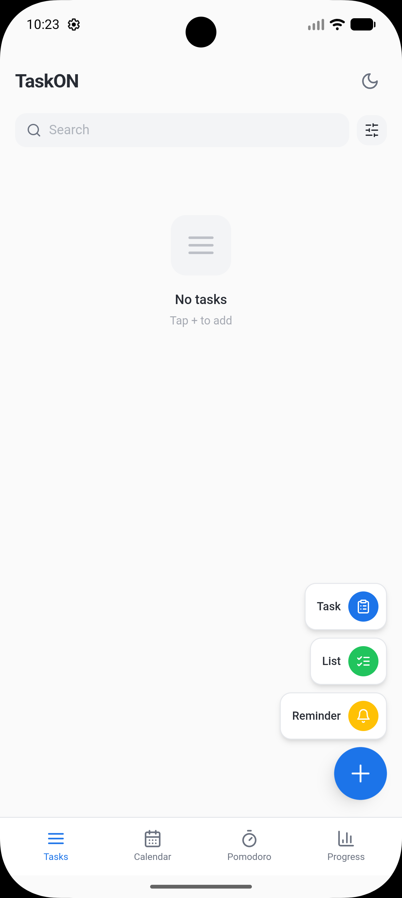
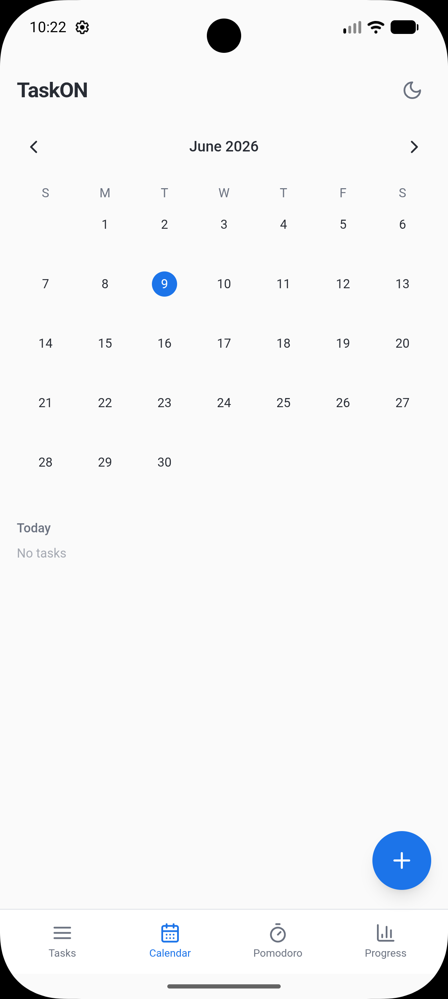
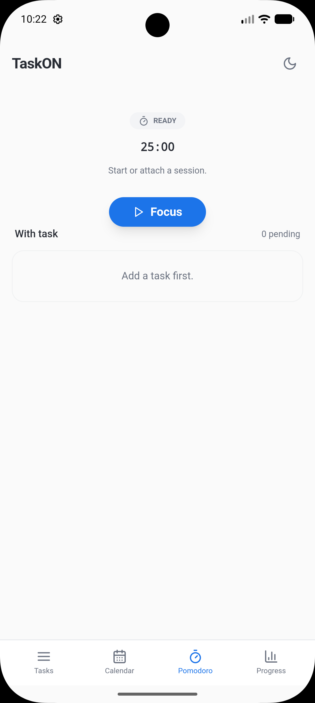
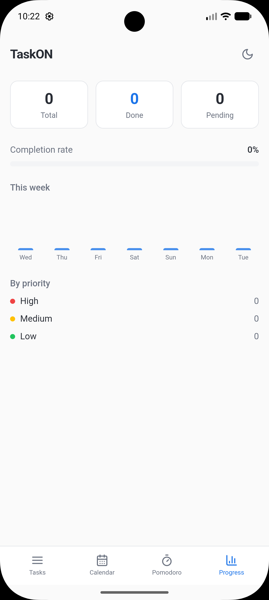
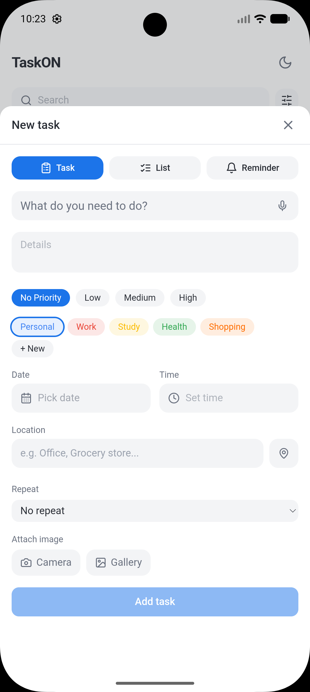
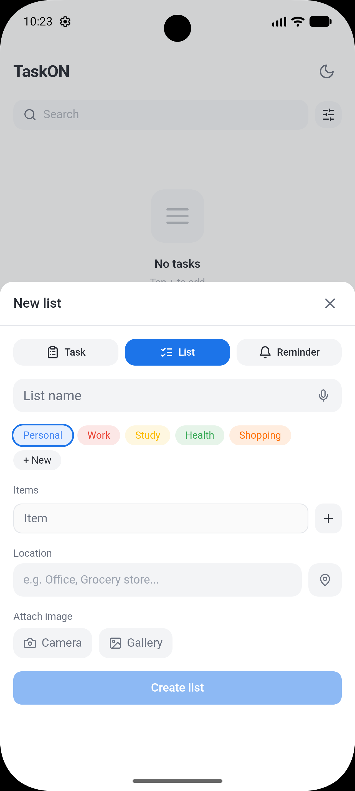
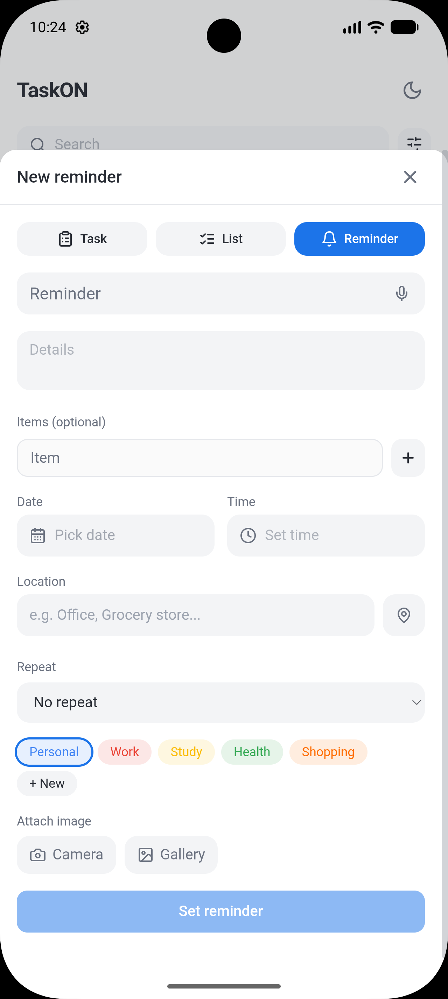

# TaskON

An Android app for managing tasks, lists, and reminders — with a Pomodoro timer, calendar view, priority levels, and progress tracking.

## Features

- Create tasks with priority, category, due date, time, location, and repeat
- Create lists with multiple items
- Set reminders with date, time, and location
- Attach images via camera or gallery
- Pomodoro focus timer attachable to tasks
- Calendar view for scheduled tasks
- Progress tracking with weekly chart and priority breakdown
- Search and filter 

## Screenshots

